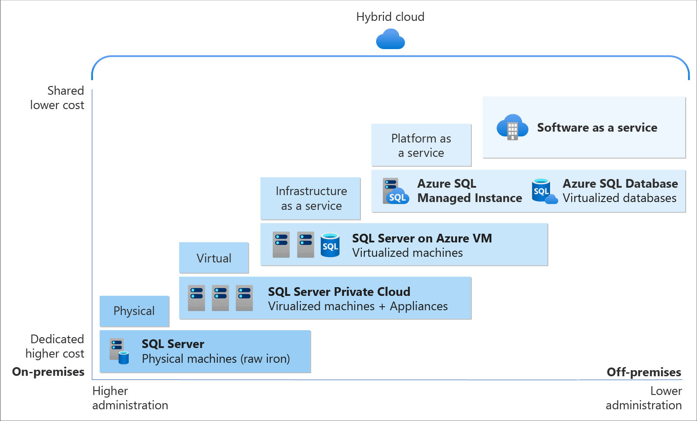

# PLAN AND IMPLEMENT DATA PLATFORM RESOURCES

## Cloud Service Models - IaaS, PaaS, SaaS

## [PaaS](https://learn.microsoft.com/en-us/training/modules/deploy-paas-solutions-with-azure-sql/)
This module focuses on ways to provision and deploy Azure SQL Database and Azure SQL Managed Instances, as well as provide guidance on the various options when performing a migration to these platforms.

- Gain an understanding of SQL Server in a Platform as a Service (PaaS) offering
- Understand PaaS provisioning and deployment options
- Understand elastic pools and hyperscale features
- Examine Azure SQL Managed Instances
- Configure a template for PaaS deployment

The PaaS offering provides less granular control over the infrastructure. It also relegates management of the underlying components (memory, CPU, storage, operating system, etc.) to Microsoft Azure.

**PaaS options for deploying SQL Server in Azure:**

### Azure SQL Database
Part of a family of products built upon the SQL Server engine, in the cloud. It gives developers a great deal of flexibility in building new application services, and granular deployment options at scale. SQL Database offers a low-maintenance solution that can be a great option for certain workloads.

### Azure SQL Managed Instance
 It's best for most migration scenarios to the cloud, as it provides fully managed services and capabilities.
 
## IaaS

### SQL Server on Azure VM
